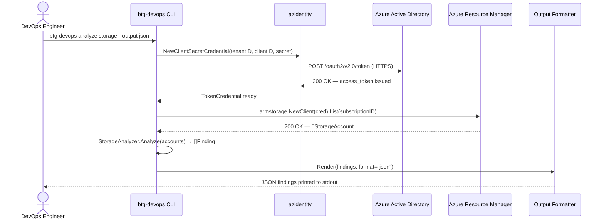
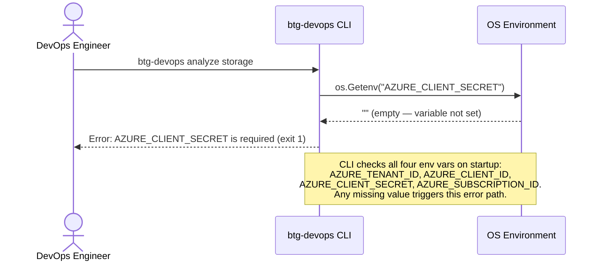
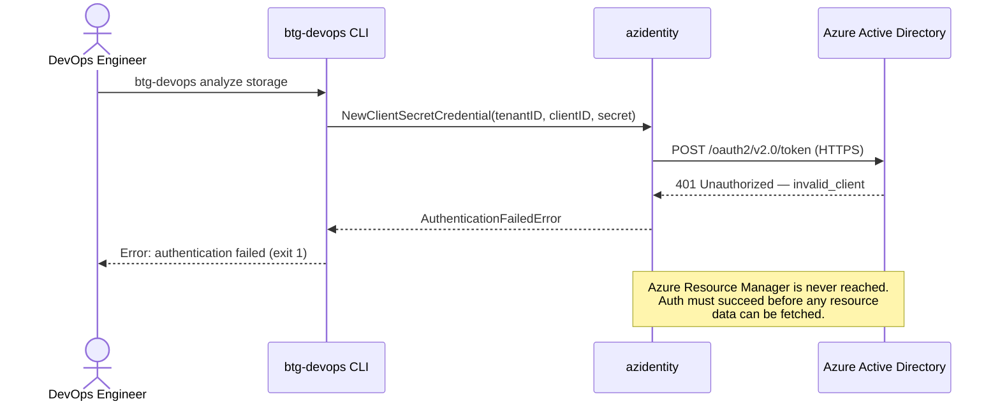

# btg-devops — Sequence Diagrams

**Version:** v0.12.0  
**Scope:** Current production CLI only — no upcoming tasks included

---

## Diagram 1 — Happy Path

> `btg-devops analyze storage --output json` runs successfully against a live Azure subscription.

---

## Diagram 2 — Missing Credentials

> One or more required environment variables are not set. The CLI exits before touching Azure.

---

## Diagram 3 — Azure Authentication Failure

> All environment variables are present but the Service Principal credentials are invalid or expired.

---

## Arrow Convention

| Arrow | Meaning |
|---|---|
| `->>` | Call / Request |
| `-->>` | Response / Return |
| Red text | Error response |